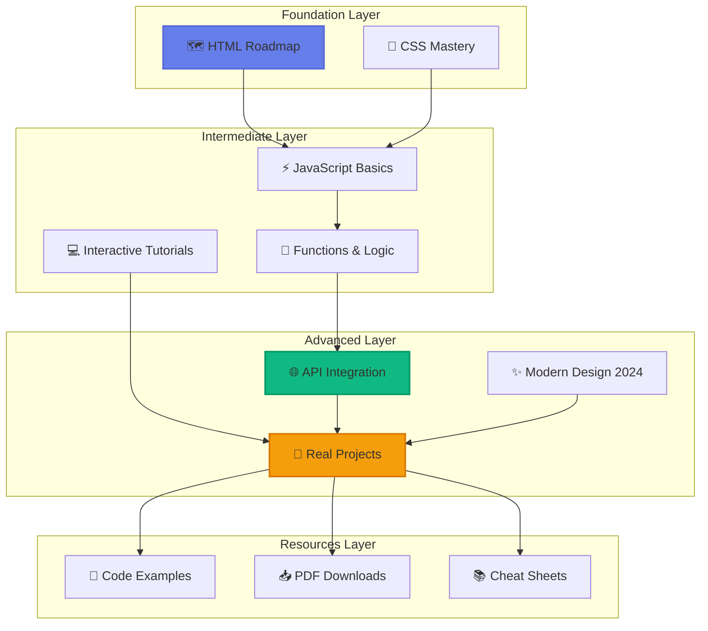
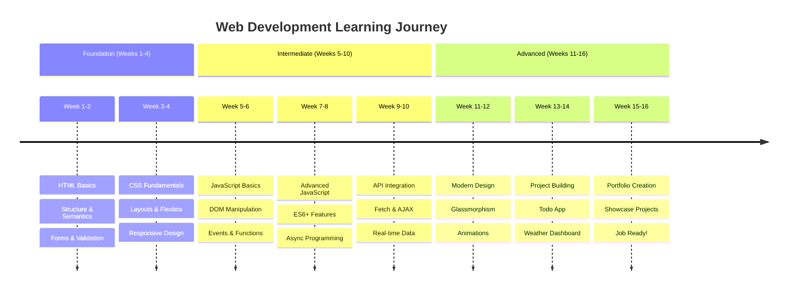

# <div align="center">👑 Samrat's Web Dev Hub</div>

<div align="center">


[](https://git.io/typing-svg)

<p align="center">
  <a href="https://github.com/SamratCrosiya/web-dev-hub/stargazers">
    
  </a>
  <a href="https://github.com/SamratCrosiya/web-dev-hub/network/members">
    
  </a>
  <a href="https://github.com/SamratCrosiya/web-dev-hub/issues">
    
  </a>
  <a href="https://github.com/SamratCrosiya/web-dev-hub/blob/master/LICENSE">
    
  </a>
</p>

<p align="center">
  
  
  
  
</p>

<p align="center">
  <a href="#-quick-demo">🎥 Demo</a> •
  <a href="#-features">✨ Features</a> •
  <a href="#-installation">⚡ Install</a> •
  <a href="#-learning-path">🗺️ Roadmap</a> •
  <a href="#-contributing">🤝 Contribute</a> •
  <a href="#-license">📜 License</a>
</p>


</div>

## 📖 Table of Contents

- [🎯 Overview](#-overview)
- [🌟 Key Features](#-key-features)
- [🎥 Quick Demo](#-quick-demo)
- [🏗️ Learning Structure](#️-learning-structure)
- [💻 Tech Stack](#-tech-stack)
- [⚡ Installation](#-installation)
- [📚 Course Modules](#-course-modules)
- [🗺️ Learning Path](#️-learning-path)
- [📊 Project Stats](#-project-stats)
- [🤝 Contributing](#-contributing)
- [📄 License](#-license)
- [👨‍💻 About Creator](#-about-creator)
- [🙏 Acknowledgments](#-acknowledgments)

---

## 🎯 Overview

<div align="center">

```ascii
╔═══════════════════════════════════════════════════════════════════╗
║                                                                   ║
║   👑  Samrat's Web Dev Hub - Your Complete Coding Journey  👑    ║
║                                                                   ║
║   Transform from absolute beginner to professional developer     ║
║   with hands-on tutorials, real projects, and modern design      ║
║                                                                   ║
╚═══════════════════════════════════════════════════════════════════╝
```

</div>

**Samrat's Web Dev Hub** is a comprehensive, all-in-one learning platform designed to take you from complete beginner to professional web developer. This isn't just another tutorial collection—it's a complete ecosystem built for **learning by doing**.

### 🎯 Why Choose This Hub?

<table>
<tr>
<td align="center" width="25%">

<br><b>85+ Lessons</b>
<br><sub>Comprehensive Coverage</sub>
</td>
<td align="center" width="25%">

<br><b>10+ Projects</b>
<br><sub>Portfolio-Ready Work</sub>
</td>
<td align="center" width="25%">

<br><b>Modern Design</b>
<br><sub>2024 Trends Included</sub>
</td>
<td align="center" width="25%">

<br><b>100% Free</b>
<br><sub>Always & Forever</sub>
</td>
</tr>
</table>

> **💡 Learning Philosophy**: "The best way to learn programming is to build real projects. Every lesson here leads to something you can actually use and show off in your portfolio."

---

## 🌟 Key Features

<div align="center">

### 💎 What Makes This Hub Special

</div>

<table>
<tr>
<td width="50%" valign="top">

### 🗺️ **Structured Learning Roadmap**


Follow a carefully designed 10-step journey from HTML basics to advanced API integration.

**🎯 What You'll Learn:**
- ✅ HTML5 semantic structure
- ✅ CSS3 modern layouts (Flexbox & Grid)
- ✅ JavaScript ES6+ features
- ✅ Responsive design techniques
- ✅ API integration & async programming

**💡 Example Progress:**
```
Week 1-2:  HTML Foundation (10 lessons)
Week 3-4:  CSS Mastery (15 lessons)
Week 5-8:  JavaScript Complete (20 lessons)
Week 9-10: Real Projects (10 builds)
Week 11+:  Advanced Topics & Portfolio
```

</td>
<td width="50%" valign="top">

### 💻 **Interactive Code Examples**


Every concept comes with live, editable code examples you can experiment with instantly.

**🔍 Features:**
- ✅ Copy-paste ready code
- ✅ Detailed inline comments
- ✅ Best practices highlighted
- ✅ Common pitfalls explained
- ✅ Performance tips included

**📊 Code Quality:**
```javascript
// Example: Modern JavaScript Function
const fetchUserData = async (userId) => {
  try {
    const response = await fetch(`/api/users/${userId}`);
    const data = await response.json();
    return data;
  } catch (error) {
    console.error('Error fetching user:', error);
    return null;
  }
};
```

</td>
</tr>

<tr>
<td width="50%" valign="top">

### 🎨 **Modern Design Techniques**


Master the latest web design trends that make websites look professional and engaging.

**🎭 Design Styles Covered:**
- ✅ Glassmorphism (frosted glass effects)
- ✅ Neumorphism (soft UI elements)
- ✅ Gradient backgrounds & animations
- ✅ Dark mode implementation
- ✅ Micro-interactions & hover effects

**🌈 Design Example:**
```css
/* Glassmorphism Card */
.glass-card {
  background: rgba(255, 255, 255, 0.1);
  backdrop-filter: blur(10px);
  border-radius: 20px;
  border: 1px solid rgba(255, 255, 255, 0.2);
  box-shadow: 0 8px 32px rgba(0, 0, 0, 0.1);
}
```

</td>
<td width="50%" valign="top">

### 🚀 **Real-World Projects**


Build actual applications that you can add to your portfolio and show to potential employers.

**💼 Projects Include:**
- ✅ Todo List App (localStorage)
- ✅ Weather Dashboard (API integration)
- ✅ Portfolio Website (responsive)
- ✅ Chat Application (real-time)
- ✅ E-commerce Product Page

**🎯 Project Structure:**
```python
Projects/
  ├─ Beginner (3 projects)
  │  ├─ Personal Portfolio
  │  ├─ Landing Page
  │  └─ Calculator App
  ├─ Intermediate (4 projects)
  │  ├─ Todo App with DB
  │  ├─ Weather Dashboard
  │  ├─ Quiz Application
  │  └─ Blog Template
  └─ Advanced (3 projects)
     ├─ Chat Application
     ├─ E-commerce Site
     └─ Social Media Clone
```

</td>
</tr>
</table>

<div align="center">

### 🎓 **Learning Features**

<table>
<tr>
<td align="center">📝<br><b>Step-by-Step</b></td>
<td align="center">🎯<br><b>Goal-Oriented</b></td>
<td align="center">💡<br><b>Practical Tips</b></td>
<td align="center">📚<br><b>PDF Resources</b></td>
<td align="center">🔄<br><b>Regular Updates</b></td>
</tr>
</table>

</div>

---

## 🎥 Quick Demo

<div align="center">

### 🖥️ **Application Interface Showcase**

<table>
<tr>
<td width="50%" align="center">

<br><b>🏠 Main Learning Hub Interface</b>
<br><sub>Clean navigation • Progress tracking • Beautiful UI</sub>
</td>
<td width="50%" align="center">

<br><b>💻 Interactive Tutorial Page</b>
<br><sub>Live code examples • Syntax highlighting • Copy buttons</sub>
</td>
</tr>
<tr>
<td width="50%" align="center">

<br><b>🚀 Practice Projects Gallery</b>
<br><sub>Real applications • Step-by-step guides • Source code</sub>
</td>
<td width="50%" align="center">

<br><b>📝 Formatted Code Examples</b>
<br><sub>Syntax highlighting • Comments • Best practices</sub>
</td>
</tr>
</table>

### 🔗 **Try It Live!**

[](#)
[](#-installation)

</div>

---

## 🏗️ Learning Structure

<div align="center">

### **Complete Course Architecture**



### **Learning Progress Flow**

```
┌─────────────┐     ┌──────────────┐     ┌─────────────┐     ┌──────────────┐
│   Beginner  │────>│ Intermediate │────>│  Advanced   │────>│  Portfolio   │
│  Foundation │     │   Skills     │     │  Mastery    │     │    Ready     │
└─────────────┘     └──────────────┘     └─────────────┘     └──────────────┘
      ▲                    │                                          │
      │                    ▼                                          │
      │              ┌──────────────┐                                │
      │              │   Practice   │                                │
      │              │   Projects   │                                │
      │              └──────────────┘                                │
      │                                                               │
      └───────────────────────────────────────────────────────────────┘
                         Continuous Learning Loop
```

</div>

---

## 💻 Tech Stack

<div align="center">

### **Frontend Technologies**


### **Design & UI**


### **Development Tools**


</div>

---

## ⚡ Installation

### 📋 **Prerequisites**

Before you begin, ensure you have:

```bash
✓ A modern web browser (Chrome, Firefox, Safari, or Edge)
✓ Text editor (VS Code recommended)
✓ Basic computer literacy
✓ Enthusiasm to learn! 🎉
```

### 🚀 **Quick Start (60 Seconds)**

```bash
# Method 1: Download ZIP
# 1. Click the green "Code" button above
# 2. Select "Download ZIP"
# 3. Extract to your desired location
# 4. Open index.html in your browser

# Method 2: Clone with Git
git clone https://github.com/SamratCrosiya/web-dev-hub.git
cd web-dev-hub
# Open index.html in your browser

# Method 3: GitHub Desktop
# 1. Click "Code" → "Open with GitHub Desktop"
# 2. Clone to your computer
# 3. Open the folder and launch index.html
```

**🎉 That's it! No installation, no dependencies, just learning!**

### ⚙️ **Recommended Setup**

```bash
# Optional but recommended for best experience:

# 1. Install VS Code (Text Editor)
https://code.visualstudio.com/

# 2. Install useful VS Code extensions:
- Live Server (for local development)
- HTML CSS Support
- JavaScript (ES6) code snippets
- Prettier (code formatter)
- Auto Rename Tag

# 3. Install Git (for version control)
https://git-scm.com/

# 4. Browser Extensions (optional):
- ColorZilla (color picker)
- WhatFont (identify fonts)
- Responsive Viewer (test responsive design)
```

### 📦 **Project Structure**

```
web-dev-hub/
├── 📄 index.html                     # Main learning hub interface
├── 📁 tutorials/
│   ├── 📄 enhanced.html              # Modern HTML design tutorial
│   ├── 📄 website-attractive.html    # Website design guide
│   ├── 📄 ai-tutorial.html           # CSS essentials
│   ├── 📄 css.html                   # CSS mastery course
│   ├── 📄 javascript.html            # JavaScript basics
│   └── 📄 javascript-functions.html  # Functions deep dive
├── 📁 projects/
│   ├── 📄 templete.html              # Project templates
│   ├── 📄 name-logo.html             # Logo creation
│   └── 📄 download-btn.html          # Button designs
├── 📁 design/
│   └── 📄 CompleteReAd-HUB.html     # Modern design 2024
├── 📁 assets/
│   ├── 📁 images/                    # Tutorial images
│   ├── 📁 icons/                     # UI icons
│   └── 📁 fonts/                     # Custom fonts
├── 📁 resources/
│   ├── 📄 html-cheatsheet.pdf        # HTML quick reference
│   ├── 📄 css-cheatsheet.pdf         # CSS quick reference
│   └── 📄 js-cheatsheet.pdf          # JavaScript quick reference
├── 📄 README.md                      # This file
└── 📄 LICENSE                        # MIT License
```

### 🧪 **Verify Installation**

Open your browser and navigate to:
```
file:///path/to/web-dev-hub/index.html
```

You should see:
- ✅ Beautiful gradient background
- ✅ Animated logo at the top
- ✅ Navigation menu working
- ✅ Category cards displaying
- ✅ Smooth animations on hover

---

## 📚 Course Modules

<div align="center">

### **Complete Learning Curriculum**

</div>

### 1️⃣ **HTML Roadmap** 
*🗺️ Foundation • 10 Lessons • Beginner*

<table>
<tr>
<td width="50%">

**📖 What You'll Learn:**
- Document structure & semantics
- Forms and input validation
- Tables, lists, and navigation
- Media elements (images, video, audio)
- Accessibility best practices (ARIA)
- SEO-friendly HTML

**🎯 Key Topics:**
```html
├─ HTML5 Semantic Tags
├─ Form Elements & Validation
├─ Multimedia Integration
├─ Meta Tags & SEO
├─ Accessibility (WCAG)
└─ Best Practices
```

</td>
<td width="50%">

**✨ Projects:**
1. Personal Portfolio Homepage
2. Contact Form with Validation
3. Blog Article Layout
4. Product Landing Page
5. Multi-page Website Structure

**⏱️ Duration:** 2-3 weeks
**📊 Difficulty:** ⭐☆☆☆☆

</td>
</tr>
</table>

---

### 2️⃣ **CSS Mastery** 
*🎨 Styling • 15 Lessons • Beginner to Intermediate*

<table>
<tr>
<td width="50%">

**📖 What You'll Learn:**
- CSS Variables & Custom Properties
- Flexbox & Grid Layouts
- Animations & Transitions
- Glassmorphism & Neumorphism
- Responsive Design (Mobile-First)
- Dark Mode Implementation

**🎯 Key Topics:**
```css
├─ CSS Fundamentals
├─ Modern Layout Techniques
├─ Advanced Selectors
├─ Animations & Keyframes
├─ CSS Architecture (BEM)
└─ Performance Optimization
```

</td>
<td width="50%">

**✨ Projects:**
1. Glassmorphic UI Cards
2. Animated Navigation Menu
3. Responsive Grid Gallery
4. Dark Mode Toggle System
5. Modern Dashboard Layout

**⏱️ Duration:** 3-4 weeks
**📊 Difficulty:** ⭐⭐☆☆☆

</td>
</tr>
</table>

---

### 3️⃣ **JavaScript Complete** 
*⚡ Programming • 20 Lessons • Intermediate*

<table>
<tr>
<td width="50%">

**📖 What You'll Learn:**
- Variables, Data Types & Operators
- Functions (Arrow, IIFE, Callbacks)
- Arrays & Objects (Deep Dive)
- DOM Manipulation & Events
- ES6+ Features (let, const, spread)
- Asynchronous JavaScript (Promises, Async/Await)

**🎯 Key Topics:**
```javascript
├─ JavaScript Basics
├─ Functions & Scope
├─ DOM & BOM
├─ Event Handling
├─ Async Programming
└─ Modern ES6+ Syntax
```

</td>
<td width="50%">

**✨ Projects:**
1. Interactive Calculator
2. Todo List with LocalStorage
3. Dynamic Form Validator
4. Image Slider / Carousel
5. Real-time Clock & Timer

**⏱️ Duration:** 4-6 weeks
**📊 Difficulty:** ⭐⭐⭐☆☆

</td>
</tr>
</table>

---

### 4️⃣ **API Integration** 
*🌐 Backend Connection • 8 Lessons • Advanced*

<table>
<tr>
<td width="50%">

**📖 What You'll Learn:**
- Fetch API & AJAX
- RESTful API concepts
- JSON data handling
- Error handling & loading states
- Authentication (JWT basics)
- CORS & Security

**🎯 Key Topics:**
```javascript
├─ HTTP Methods (GET, POST, PUT, DELETE)
├─ Fetch API Usage
├─ Async Data Fetching
├─ Error Handling
├─ API Authentication
└─ Best Practices
```

</td>
<td width="50%">

**✨ Projects:**
1. Weather Dashboard App
2. Movie Search Engine
3. GitHub Profile Finder
4. Currency Converter
5. News Aggregator

**⏱️ Duration:** 2-3 weeks
**📊 Difficulty:** ⭐⭐⭐⭐☆

</td>
</tr>
</table>

---

### 5️⃣ **Modern Design 2024** 
*✨ UI/UX Trends • 12 Lessons • Intermediate*

<table>
<tr>
<td width="50%">

**📖 What You'll Learn:**
- Glassmorphism effects
- Neumorphism styling
- Gradient backgrounds
- Micro-interactions
- Scroll animations
- Mobile-first design

**🎯 Key Topics:**
```css
├─ Modern Design Trends
├─ Advanced CSS Effects
├─ Animation Libraries
├─ UI Component Design
├─ Color Theory
└─ Typography
```

</td>
<td width="50%">

**✨ Projects:**
1. Modern Landing Page
2. Glassmorphic Dashboard
3. Animated Portfolio
4. Interactive Pricing Cards
5. Neumorphic UI Kit

**⏱️ Duration:** 2-3 weeks
**📊 Difficulty:** ⭐⭐⭐☆☆

</td>
</tr>
</table>

---

### 6️⃣ **Practice Projects** 
*🚀 Real Applications • 10+ Projects • All Levels*

<div align="center">

**Build Portfolio-Ready Applications**

</div>

<table>
<tr>
<td width="33%" align="center">

**Beginner**
```
├─ Personal Portfolio
├─ Landing Page
└─ Calculator
```

</td>
<td width="33%" align="center">

**Intermediate**
```
├─ Todo App
├─ Weather Dashboard
├─ Quiz App
└─ Blog Template
```

</td>
<td width="33%" align="center">

**Advanced**
```
├─ Chat Application
├─ E-commerce Site
└─ Social Media Clone
```

</td>
</tr>
</table>

---

## 🗺️ Learning Path

<div align="center">

### **Your Journey from Zero to Hero**

</div>



### ✅ **Milestone Checklist**

<table>
<tr>
<td width="25%">

**🎯 Beginner** 
- [ ] Complete HTML Roadmap
- [ ] Finish CSS Basics
- [ ] Build first website
- [ ] Understand box model
- [ ] Create responsive layouts

</td>
<td width="25%">

**🚀 Intermediate**
- [ ] Master JavaScript fundamentals
- [ ] Complete DOM manipulation
- [ ] Build interactive projects
- [ ] Learn ES6+ features
- [ ] Work with APIs

</td>
<td width
