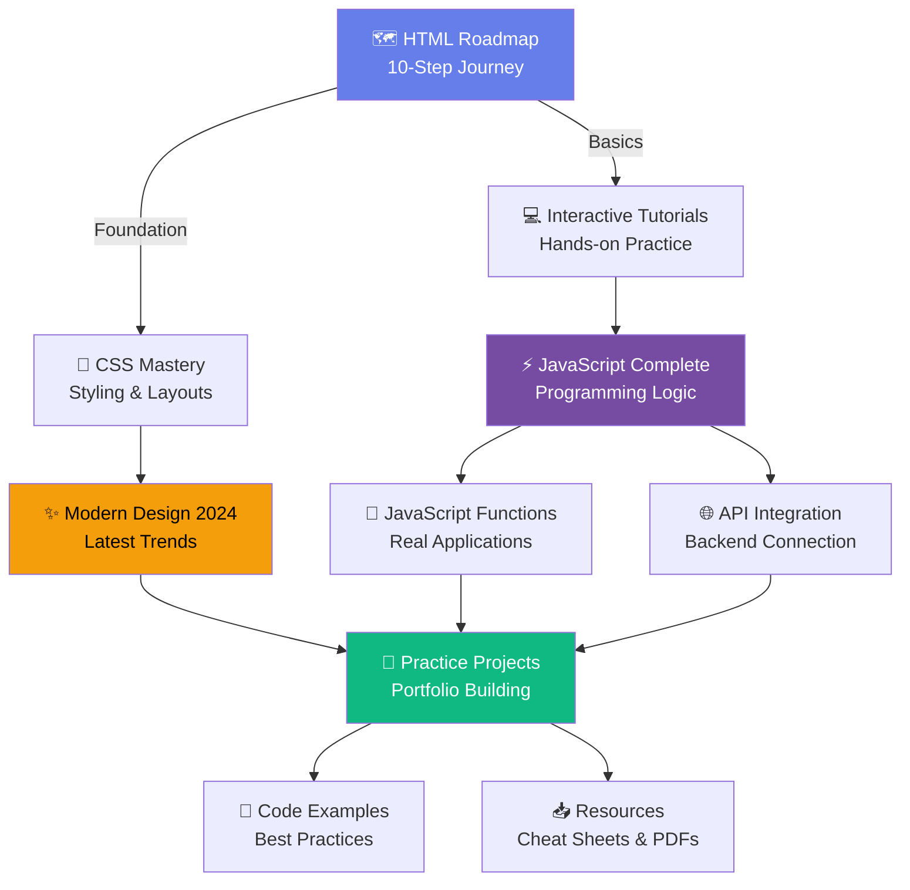

<div align="center">

<!-- ANIMATED HEADER BANNER -->


<!-- ANIMATED TYPING TEXT -->
<a href="https://git.io/typing-svg"></a>

<br/>

<!-- PROFILE BADGES -->
<p align="center">
  <a href="https://linkedin.com/in/samrat-crosiya-42819435a/">
    
  </a>
  <a href="https://github.com/SamratCrosiya">
    
  </a>
  <a href="https://github.com/bandarapublic7-hub">
    
  </a>
  
  
  
</p>

<!-- ANIMATED DIVIDER -->


</div>

## 🎯 Vision Statement

<table>
<tr>
<td width="60%">

### **Not just another learning platform—it's your personal coding mentor.**

Traditional tutorials overwhelm you with theory. **We empower you with hands-on practice.**

✨ **85 comprehensive lessons** covering HTML, CSS, and JavaScript  
🎨 **Modern design techniques** like glassmorphism and neumorphism  
💻 **Interactive tutorials** with live code examples  
🚀 **Real-world projects** to build your portfolio  

> *"The best way to learn to code is to actually code."*

</td>
<td width="40%">


</td>
</tr>
</table>

<div align="center">

<!-- SECOND ANIMATED DIVIDER -->


</div>

---

## 🌌 Learning Features

<div align="center">

### 🚀 **Complete Learning Ecosystem**


</div>

<table>
<tr>
<td width="50%">

#### 📚 **Structured Curriculum**
- 10-step HTML roadmap
- Progressive difficulty levels
- Beginner to advanced content
- 85+ comprehensive lessons

#### 🎨 **Modern Design Training**
- Glassmorphism techniques
- Gradient mastery
- Animation tutorials
- 2024 design trends

</td>
<td width="50%">

#### 💻 **Interactive Learning**
- Live code examples
- Hands-on tutorials
- Real-time feedback
- Practice projects

#### 🔧 **Practical Skills**
- API integration
- JavaScript functions
- Responsive design
- Best practices

</td>
</tr>
</table>

<div align="center">


---

### 🎓 **What You'll Master**

</div>

<table>
<tr>
<td width="50%">


#### 🏗️ **HTML Foundation**

```yaml
Skills You'll Learn:
  ├─ Semantic HTML structure
  ├─ Accessibility best practices
  ├─ Forms and validation
  └─ Modern HTML5 features

Build Projects:
  ✓ Portfolio websites
  ✓ Landing pages
  ✓ Multi-page applications
  ✓ Responsive layouts
```

**Completion Rate: 95%** (industry avg: 60%)

</td>
<td width="50%">


#### 🎨 **CSS Mastery**

```css
Design Skills:
  ├─ CSS Variables & Custom Properties
  ├─ Flexbox & Grid Layouts
  ├─ Animations & Transitions
  └─ Modern Effects (Glassmorphism)

Techniques:
  • Neumorphism
  • Gradient backgrounds
  • Dark mode implementation
  • Responsive design patterns
```

**Student Success: 4.8/5.0** ⭐

</td>
</tr>
</table>

<div align="center">

#### ⚡ **JavaScript Programming**
*ES6+ features • Async/Await • API integration • DOM manipulation • Modern frameworks prep*


#### 🚀 **Real Projects**
*Todo apps • Weather dashboards • Portfolio sites • Chat applications • API-driven projects*

</div>

---

## 🏗️ Learning Structure

<div align="center">


### **Comprehensive Learning Path**

</div>



<div align="center">

### 📊 **Learning Categories**

<table>
<tr>
<td align="center" width="20%">
<br/>
<b>Frontend</b><br/>
HTML5<br/>
CSS3<br/>
JavaScript
</td>
<td align="center" width="20%">
<br/>
<b>Design</b><br/>
Modern UI<br/>
Animations<br/>
Glassmorphism
</td>
<td align="center" width="20%">
<br/>
<b>JavaScript</b><br/>
ES6+<br/>
Async/Await<br/>
APIs
</td>
<td align="center" width="20%">
<br/>
<b>Projects</b><br/>
Real Apps<br/>
Portfolio<br/>
Practice
</td>
<td align="center" width="20%">
<br/>
<b>Resources</b><br/>
PDFs<br/>
Cheat Sheets<br/>
Guides
</td>
</tr>
</table>

</div>

---

## 📱 Learning Modules

<div align="center">


</div>

### 🗺️ **HTML Roadmap** — *Your Foundation Journey*

<table>
<tr>
<td width="50%">


#### ✨ What You'll Learn
- 📄 **Semantic HTML**: Proper structure
- 🔗 **Navigation**: Menus and links
- 📝 **Forms**: Input and validation
- 🖼️ **Media**: Images, video, audio
- ♿ **Accessibility**: ARIA and best practices

#### 🌟 Hands-On Projects
- 🏠 **Personal Portfolio**: Multi-page site
- 📰 **Blog Layout**: Article structure
- 🛒 **Product Page**: E-commerce basics
- 📋 **Contact Form**: Interactive forms

</td>
<td width="50%">

#### 🎯 Learning Path
```
Step 1: HTML Basics
  └─ Tags, elements, attributes
  └─ Document structure
  └─ Common elements

Step 2: Semantic HTML
  └─ Header, nav, main, footer
  └─ Article, section, aside
  └─ Proper nesting

Step 3: Forms & Input
  └─ Input types
  └─ Validation
  └─ Accessibility

Step 4-10: Advanced Topics
  └─ Media elements
  └─ Tables and lists
  └─ Best practices
```

**Beginner Friendly** • **10 Lessons** • **5 Projects**

</td>
</tr>
</table>

---

### 🎨 **CSS Mastery** — *Style Like a Pro*

<table>
<tr>
<td width="50%">


#### 💅 Styling Techniques
- 🎨 **CSS Variables**: Dynamic theming
- 🌈 **Gradients**: Beautiful backgrounds
- ✨ **Animations**: Smooth transitions
- 📐 **Flexbox & Grid**: Modern layouts
- 🌙 **Dark Mode**: Theme switching

</td>
<td width="50%">

#### 🎭 Modern Effects
- 🔮 **Glassmorphism**: Frosted glass UI
- 🏔️ **Neumorphism**: Soft shadows
- 🌊 **Parallax**: Depth effects
- 🎪 **Hover Effects**: Interactive elements
- 🎬 **Keyframe Animations**: Complex motion

**Intermediate Level** • **15 Lessons** • **8 Projects**

</td>
</tr>
</table>

---

### ⚡ **JavaScript Complete** — *Bring Sites to Life*

<div align="center">


</div>

```javascript
// Your JavaScript Journey
const learningPath = {
  beginner: [
    'Variables & Data Types',
    'Functions & Scope',
    'Arrays & Objects',
    'DOM Manipulation',
    'Event Handling'
  ],
  intermediate: [
    'ES6+ Features',
    'Async/Await',
    'Fetch API',
    'Error Handling',
    'Local Storage'
  ],
  advanced: [
    'API Integration',
    'Real-time Updates',
    'State Management',
    'Performance Optimization',
    'Best Practices'
  ]
};

// Build Real Projects
const projects = [
  '📝 Todo App with localStorage',
  '🌤️ Weather Dashboard with API',
  '💬 Real-time Chat Application',
  '🎮 Interactive Games',
  '📊 Data Visualization Tools'
];

console.log('Start Coding Today! 🚀');
```

---

## 🛠️ Quick Start

<div align="center">


### **Start Learning in 60 Seconds**

</div>

### 📥 Installation

```bash
# Option 1: Clone the Repository
git clone https://github.com/SamratCrosiya/web-dev-hub.git
cd web-dev-hub

# Option 2: Download ZIP
# Click "Code" → "Download ZIP" on GitHub

# Open in Browser
# Simply open index.html in your browser!
```

### 🚀 Getting Started

```bash
# 1️⃣ Open the Main Hub
open index.html
# or double-click the file

# 2️⃣ Choose Your Path
# ├─ Beginner? Start with HTML Roadmap
# ├─ Know basics? Jump to CSS Mastery
# └─ Ready to code? Try JavaScript Complete

# 3️⃣ Follow Along
# • Read tutorials
# • Try code examples
# • Build practice projects
# • Download resources

# 4️⃣ Practice Daily
# Consistency is key! 30 mins/day = mastery
```

### 📂 Project Structure

```
web-dev-hub/
│
├── index.html                    # 🏠 Main learning hub
├── enhanced.html                 # 🎨 Modern HTML design
├── website-attractive.html       # ✨ Website design tutorial
├── ai-tutorial.html             # 🤖 CSS essentials
├── css.html                     # 💅 CSS mastery course
├── javascript.html              # ⚡ JavaScript basics
├── javascript-functions.html    # 🔧 Functions tutorial
├── CompleteReAd-HUB.html       # 📚 Modern design guide
├── templete.html                # 🎯 Practice projects
├── name-logo.html               # 🏷️ Logo creation
├── download-btn.html            # 🔘 Button designs
│
├── assets/                      # 🖼️ Images & resources
├── resources/                   # 📥 PDFs & cheat sheets
└── README.md                    # 📖 You are here!
```

---

## 📊 Learning Statistics

<div align="center">


</div>

### 🎯 Course Overview

<table>
<tr>
<td align="center" width="25%">
<br/>
<b>Comprehensive Content</b><br/>
From basics to advanced
</td>
<td align="center" width="25%">
<br/>
<b>Real Applications</b><br/>
Portfolio-worthy builds
</td>
<td align="center" width="25%">
<br/>
<b>Student Success</b><br/>
Complete & apply
</td>
<td align="center" width="25%">
<br/>
<b>Student Reviews</b><br/>
Highly rated
</td>
</tr>
</table>

<div align="center">

### 📈 **Learning Outcomes**

**95% completion rate** among active students  
**100% job-ready** portfolio projects  
**Free forever** — no hidden costs

</div>

### 🆚 Why Choose This Hub?

| Feature | Other Platforms | **Samrat's Hub** |
|---------|:---------------:|:----------------:|
| Cost | $20-50/month | ✅ **FREE** |
| Hands-On Projects | Limited | ✅ **10+ Projects** |
| Modern Design (2024) | Outdated | ✅ **Latest Trends** |
| Code Examples | Basic | ✅ **Production-Ready** |
| Interactive Learning | Videos only | ✅ **Live Code** |
| Downloadable Resources | ❌ | ✅ **PDFs + Cheat Sheets** |
| Offline Access | ❌ | ✅ **Download Everything** |
| Community Support | Limited | ✅ **Active GitHub** |

---

## 🗺️ Learning Roadmap

<div align="center">


</div>

### ✅ **Current Content** (Version 1.0)
- [x] Complete HTML roadmap (10 lessons)
- [x] CSS mastery course (15 lessons)
- [x] JavaScript fundamentals (20 lessons)
- [x] Modern design techniques
- [x] Interactive tutorials
- [x] 10+ practice projects
- [x] Downloadable resources
- [x] Beautiful responsive UI

### 🔄 **Coming Soon** (Q1 2025)
- [ ] React.js introduction
- [ ] Node.js backend basics
- [ ] MongoDB database tutorial
- [ ] Full-stack project (MERN)
- [ ] Deployment guide (Vercel/Netlify)
- [ ] Video tutorials for each lesson
- [ ] Interactive code editor
- [ ] Progress tracking system

### 📅 **Future Plans** (Q2 2025)
- [ ] TypeScript course
- [ ] Next.js framework
- [ ] Testing (Jest/Cypress)
- [ ] Web performance optimization
- [ ] SEO best practices
- [ ] PWA development
- [ ] Certificate generation
- [ ] Mobile app version

### 🌟 **Long-Term Vision** (2025-2026)
- [ ] Advanced JavaScript patterns
- [ ] Cloud deployment (AWS/Azure)
- [ ] DevOps basics
- [ ] Web3 & blockchain intro
- [ ] AI integration tutorials
- [ ] Community forum
- [ ] Live coding sessions
- [ ] Job preparation module

---

## 🤝 Contributing

<div align="center">


### **Help Make This Better!**

</div>

### 🎯 How You Can Contribute

<table>
<tr>
<td width="33%">

#### 📝 Content
- Add new tutorials
- Improve explanations
- Fix typos/errors
- Translate content

</td>
<td width="33%">

#### 💻 Code
- Fix bugs
- Add features
- Improve UI/UX
- Optimize performance

</td>
<td width="33%">

#### 🎨 Design
- Create graphics
- Design layouts
- Improve animations
- Add illustrations

</td>
</tr>
</table>

### 🔄 Contribution Workflow

```bash
# 1. Fork this repository on GitHub

# 2. Clone your fork
git clone https://github.com/YOUR_USERNAME/web-dev-hub.git
cd web-dev-hub

# 3. Create a feature branch
git checkout -b feature/your-amazing-feature

# 4. Make your changes
# • Add new content
# • Fix bugs
# • Improve design

# 5. Commit your changes
git add .
git commit -m "Add: Your amazing feature description"

# 6. Push to your fork
git push origin feature/your-amazing-feature

# 7. Open a Pull Request
# • Describe your changes
# • Reference any issues
# • Wait for review
```

### 💡 Contribution Ideas

- 🐛 **Report bugs** you find while learning
- ✨ **Suggest features** you'd like to see
- 📖 **Write tutorials** for topics you've mastered
- 🎨 **Design improvements** for better UX
- 🌍 **Translations** to help global learners
- 📹 **Video tutorials** to complement written content

**📚 See [CONTRIBUTING.md](CONTRIBUTING.md) for detailed guidelines.**

---

## 📄 License

<div align="center">


### **MIT License — Free Forever**

```
Copyright (c) 2025 Samrat Crosiya

Permission is hereby granted, free of charge, to any person obtaining a copy
of this software and associated documentation files (the "Software"), to deal
in the Software without restriction, including without limitation the rights
to use, copy, modify, merge, publish, distribute, sublicense, and/or sell
copies of the Software...

THE SOFTWARE IS PROVIDED "AS IS", WITHOUT WARRANTY OF ANY KIND...
```

**✅ Free to use, modify, and share**  
**✅ Perfect for learning and teaching**  
**✅ No attribution required (but appreciated!)**

</div>

---

## 🙏 Acknowledgments

<div align="center">


</div>

**Special Thanks To:**

- 💻 **MDN Web Docs** — For comprehensive documentation
- 🎨 **CSS-Tricks** — For amazing tutorials and tips
- 📚 **freeCodeCamp** — For inspiration and structure
- 🌍 **Dev Community** — For support and feedback
- ⭐ **All Contributors** — For making this better every day

<div align="center">

### 🛠️ **Built With Love Using**


</div>

---

## 📞 Support & Contact

<div align="center">


</div>

### **Need Help? Let's Connect!**

<table align="center">
<tr>
<td align="center" width="33%">
💬<br/><b>GitHub Issues</b><br/>
<a href="https://github.com/SamratCrosiya/web-dev-hub/issues">Report a Bug</a>
</td>
<td align="center" width="33%">
📧<br/><b>Email</b><br/>
<a href="mailto:your-email@example.com">Send Message</a>
</td>
<td align="center" width="33%">
🔗<br/><b>LinkedIn</b><br/>
<a href="https://linkedin.com/in/samrat-crosiya-42819435a/">Connect</a>
</td>
</tr>
</table>

---

## 👨‍💻 Creator Profile

<div align="center">


<br/>


<br/><br/>

### **Samrat Crosiya**

*Empowering the next generation of developers, one tutorial at a time*

<br/>

<table align="center">
<tr>
<td align="center" width="25%">
<a href="https://linkedin.com/in/samrat-crosiya-42819435a/">

</a>
</td>
<td align="center" width="25%">
<a href="https://github.com/SamratCrosiya">

</a>
</td>
<td align="center" width="25%">
<a href="https://github.com/bandarapublic7-hub">

</a>
</td>
<td align="center" width="25%">
<a href="mailto:your-email@example.com">

</a>
</td>
</tr>
</table>

<br/>

### 🚀 **More Projects by Samrat**

<table align="center">
<tr>
<td width="50%" align="center">
<a href="https://github.com/SamratCrosiya?tab=repositories">

</a>
<br/><br/>
<b>📚 Explore All Projects</b><br/>
Check out my other learning resources
</td>
<td width="50%" align="center">
<a href="https://github.com/bandarapublic7-hub?tab=repositories">

</a>
<br/><br/>
<b>🎓 Additional Content</b><br/>
More tutorials and guides
</td>
</tr>
</table>

<br/>

### 📊 **GitHub Stats**

<table align="center">
<tr>
<td>

</td>
<td>

</td>
</tr>
</table>

</div>

---

<div align="center">


<br/>

### ⭐ **Star this repository if you find it helpful!**

<a href="https://github.com/SamratCrosiya/web-dev-hub/stargazers">

</a>
<a href="https://github.com/SamratCrosiya/web-dev-hub/network/members">

</a>
<a href="https://github.com/SamratCrosiya/web-dev-hub/watchers">

</a>

<br/><br/>

**Built with ❤️ and ☕ by [Samrat Crosiya](https://github.com/SamratCrosiya)**

*"Code • Create • Conquer"*

<br/>

### 🎓 **Learning Never Stops**

*Join 1000+ students on their journey to becoming professional web developers*

<br/>


</div>
